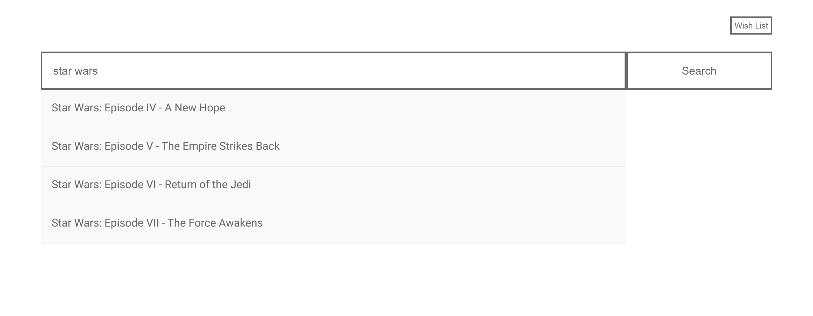
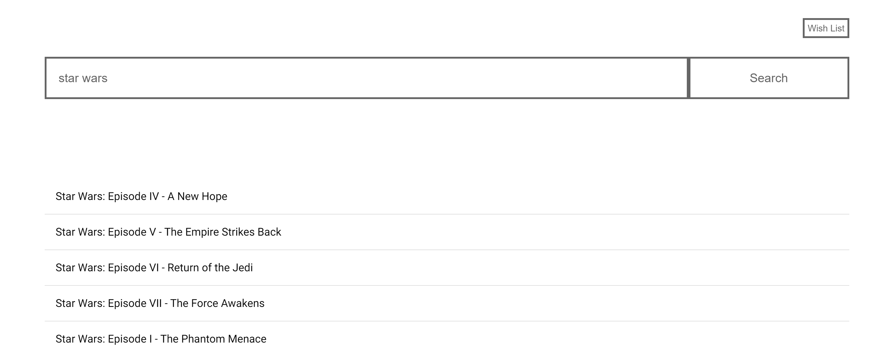
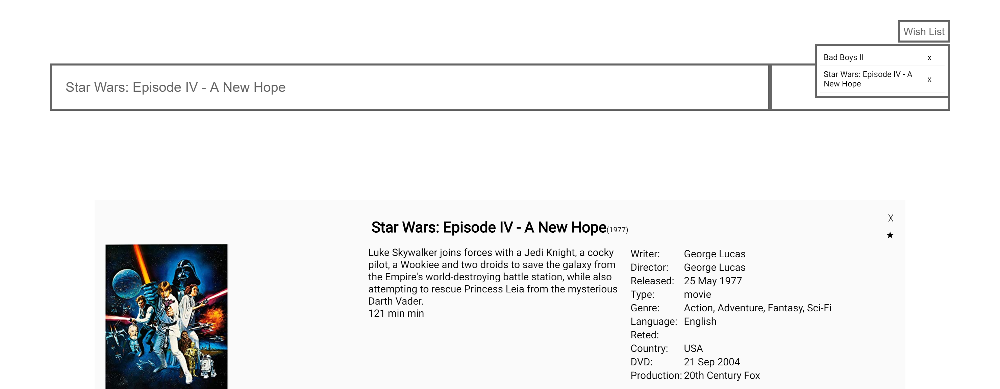

# Project Name

> Movie search engine.

## Table of contents

- [General info](#general-info)
- [Screenshots](#screenshots)
- [Technologies](#technologies)
- [Setup](#setup)
- [Features](#features)
- [Status](#status)
- [Inspiration](#inspiration)
- [Contact](#contact)

## General info

The project was created as a response to the Front-end recruitment task.

## Screenshots






## Technologies

- HTML5
- CSS3
- JavaScript(ES6)/React

## Setup

Clone or download github repository:
`https://github.com/filuus/movies.git`
and install all dependencies:

```
npm install
```

run the project:

```
npm run devserver
```

next go to the address: http://localhost:3000/

## Features

List of features:

- Search for movies by title
- Adding a movie to wish list

To-do list:

- Adapting the website to mobile devices(RWD)

## Status

Project is: _in progress_

## Inspiration

Thanks to 'Filmweb' for inspiration

## Contact

Created by [@filuus](https://github.com/filuus) - feel free to contact me!
